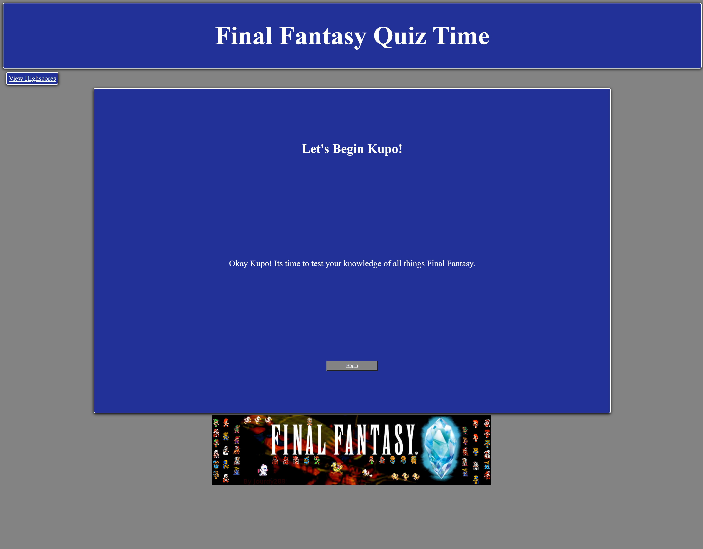
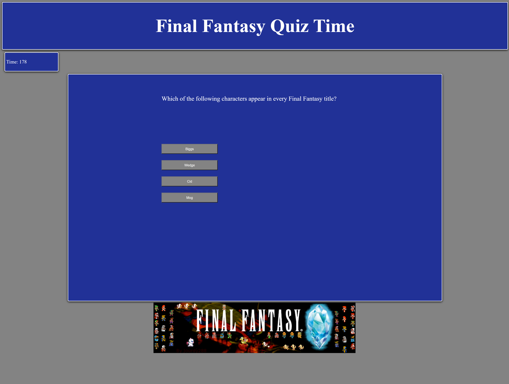
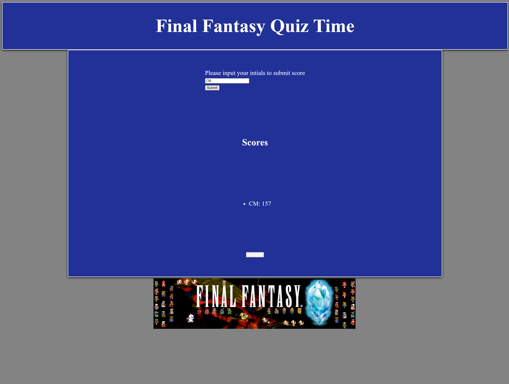

# Final Fantasy Quiz Time

## Description

This is browser based quix to test a users Final Fantasy knowledge, and time them for a scoring system.

## Features

Home Page: The home page greets the user and gives them a brief description of what comes next before they click the begin button.

Quiz Page: This is wher the user will participate in the quiz and go through the various questions until they eiher run out of time or complete the quiz.

Results Page: This is the end of the quiz and allows the user to submit their time score after completion.

## How to Use

- 1. Access the homepage via an html link or by inputing the html manually
- 2. After reading the homepage introduction message, click on the button labelled "Begin" to start the quiz
- 3. Once the quiz is started a timer will start and you will be presented 4 choices to choose from displayed under the question, if correct then the next questiona nd choices will appear and a message stating that the selection was correct will appear at the bottom of the screen.  If the selection is incorrect then the question wont change and a message will appear at the bottom of the screen that the selection was incorrect, and 5 seconds will be removed from the timer as a penalty.
- 4. Upon completing the quiz, or failing by letting the timer hit 0, you will be redirected to the scores html where you submit your score.
- 5. If you submit your score it will be input into the scores box below the submission area.
- 6. If the user chooses there is also a retry button at the bottom of the page to reset the quiz and try again.

## Live Link

https://massicottec.github.io/quiz-time/

## Github Link

https://github.com/massicottec/quiz-time

### Credits

massicottec
jourdy288 - images